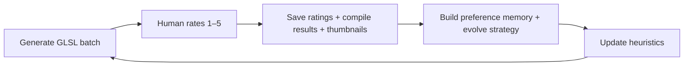

# ShaderMind

**An agent that draws. You become the artist.**

ShaderMind is a drawing tool — but the hand holding the pen is an agent. It generates live GLSL sketches; **you** steer with 1–5 ratings and short notes. It learns **your** taste over time and nudges each new batch a little closer to what you love and wanted to see.

Like a sketchbook that remembers: everyday shaders, **small changes from the last**, not reinventions. Inspired by [Zach Lieberman's daily code sketches](https://zachlieberman.medium.com/i-spent-10-years-making-a-sketch-in-code-every-day-and-heres-what-i-learned-b845e811160d). The **3,650** count is a north-star metaphor for that practice — not a calendar.

Under the hood, preference memory follows [PLUS](https://arxiv.org/abs/2507.13579): your taste compressed into readable text that sharpens every batch.

**Hackathon:** 2026 AI Engineer World's Fair · Continual Learning track

---

## For AI agents — read this first

| Step | Document |
|------|----------|
| 1 | **[AGENTS.md](./AGENTS.md)** — handoff, repo map, API, env, open bugs |
| 2 | **[agents-learning-model.md](./agents-learning-model.md)** — code-aware learning memory model |
| 3 | **[work/learning-feature.md](./work/learning-feature.md)** — spec + remaining work |

---

## Why it exists

| Problem | ShaderMind's answer |
|---|---|
| AI art does the creating *for* you | **You** curate; the **agent** draws — you grow into the artist |
| One-size-fits-all taste | Learns **your** preference memory + strategy genome |
| Prompt → image, then forget | Everyday sketches; each batch changes a bit from the last |
| Opaque tools | 1–5 ratings, reflection log, evolution timeline you can read |

---

## See it in 30 seconds

1. Open the **Studio** — live WebGL shaders animate with `u_time`, `u_resolution`, `u_mouse`.
2. Rate every shader **1–5**, add an optional note, hit **Submit & next batch**.
3. Scroll **Mind** — heuristics distilled from your rating distribution.
4. Scroll **Evolution** — generation milestones with thumbnails of high-rated work.
5. Click **Explain artistic evolution** — the agent narrates its own arc.

The artifact isn't one pretty shader. It's **you**, learning taste through a tool that draws — sketch by sketch, change by change.

---

## Continual learning loop



**Human-in-the-loop by default** — the agent never auto-rates your batch unless you switch to autonomous/hybrid mode.

**Fast path** — one inference call writes a full batch of compile-ready shaders; strategy evolution runs in the background so the next batch starts immediately.

**Code-aware learning** — retrieval over past shaders, similarity checks, and preference memory inform staged generation and evolution.

---

## Interface

| Region | What you get |
|---|---|
| **Studio** | Current batch in a full-width gallery; click any cell for detail view |
| **Latest reflection** | Agent self-criticism after your last curation |
| **Evolution** | Real milestones per generation — notes + thumbnails of 4–5 rated shaders |
| **Mind** | Learned heuristics, reflection log, artistic monologue |

Batch composition (configurable, default **3**): evolutionary remixes from approved shaders, directive responses to your notes, and mutation sketches with an explicit hypothesis on the card.

---

## Tech stack

| Layer | Choice |
|---|---|
| Frontend | Vanilla HTML/CSS/JS, shared WebGL grid renderer, editorial gallery UI |
| Backend | Node.js + Express |
| AI | **DigitalOcean Inference** (primary) — per-task model pools; optional Gemini fallback |
| Storage | **MongoDB Atlas** in production; optional **SQLite** locally; `database.json` for dev / failover / mirror |
| Deploy | DigitalOcean App Platform or Docker (`8080`) |

### Generation pipeline

1. **Fast mode** — metadata + inline GLSL in one JSON response
2. **Staged mode** — plan concepts, then per-shader GLSL with learning context
3. **Validate & patch** — WebGL 1.0 sanitizer, anti-lazy shader validation
4. **Human curation** — 1–5 ratings persisted; thumbnails on 4–5
5. **Async evolution** — critique, preference memory, heuristics + strategy genome update

---

## Quick start

### Prerequisites

- Node.js 20+
- [DigitalOcean Model Access Key](https://docs.digitalocean.com/products/gradient-ai-platform/how-to/use-serverless-inference/)
- MongoDB Atlas URI (recommended for production)

### Run locally

```bash
git clone https://github.com/jin-dalrae/shadermind.git
cd shadermind
npm install
cp .env.example .env
# Edit .env — set DIGITAL_OCEAN_MODEL_ACCESS_KEY (and MONGODB_URI for production parity)
npm start
```

Open **http://localhost:8080**

```bash
npm test
```

Set `AUTOPILOT=false` in `.env` to browse saved art without generating.

### Migrate local JSON → MongoDB

```bash
npm run migrate:mongo
```

### Deploy (DigitalOcean App Platform)

1. Connect this repo; set `run_command` to `node server.js`
2. Add secrets: `DIGITAL_OCEAN_MODEL_ACCESS_KEY`, `MONGODB_URI`
3. Without `MONGODB_URI`, deploy falls back to bundled `database.json` — your Atlas history won't appear in production

See `.do/app.yaml` and `Dockerfile` for reference configs.

---

## Configuration highlights

| Variable | Default | Purpose |
|---|---|---|
| `LEARNING_MODE` | `human` | `human` · `autonomous` · `hybrid` |
| `GENERATION_MODE` | `fast` | `fast` (1 call) or `staged` (plan + N GLSL calls) |
| `BATCH_SIZE` | `3` | Shaders per generation |
| `CODE_AWARE_LEARNING` | `true` | Retrieval + preference memory in generation |
| `USE_SQLITE` | `false` | Local SQLite with optional JSON mirror |
| `AUTOPILOT_INTERVAL_MS` | `0` | Delay after submit before next batch |
| `EVOLUTION_ASYNC` | `true` | Strategy update in background |

Full list in [`.env.example`](.env.example).

---

## Hackathon alignment

**Theme: Continual Learning** — ShaderMind adapts *how* it generates from real curation feedback: memory rollups, preference memory, heuristic extraction, strategy rewrites, and remix seeds from high-rated shaders.

**Research tie-in: PLUS** — Like PLUS's preference summaries, ShaderMind compresses curation history into interpretable text that conditions the next generation — not a frozen reward model.

**Prizes**

- **DigitalOcean** — Inference-native stack, App Platform deploy, lightweight Node server
- **Gemini** — Optional fallback path (`ALLOW_GEMINI_FALLBACK=true`)

---

## Project structure

```
shadermind/
├── server.js              # Express API, autopilot loop, generation
├── lib/                   # AI routing, GLSL validation, memory, learning engine
├── public/                # Gallery UI, shared grid renderer, shader patcher
├── storage/               # MongoDB + SQLite + JSON adapters
├── test/                  # Learning engine tests
├── scripts/               # migrate:mongo, repair:glsl
└── work/                  # Agent handoff docs
```

---

## References

- Nam, H., Wan, Y., Liu, M., Ahnn, P., Lian, J., & Jaques, N. (2025/2026). *Learning to summarize user information for personalized reinforcement learning from human feedback.* [arXiv:2507.13579](https://arxiv.org/abs/2507.13579)
- Lieberman, Z. — [*I spent 10 years making a sketch in code every day*](https://zachlieberman.medium.com/i-spent-10-years-making-a-sketch-in-code-every-day-and-heres-what-i-learned-b845e811160d) — everyday sketches, small deltas from the last, learning toward what you love (3,650 north star)

---

## License

Hackathon prototype — see repository for usage terms.