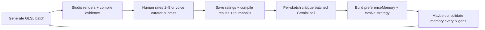
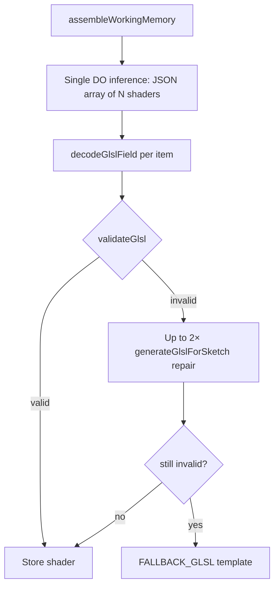

# ShaderMind

**An agent that draws. You become the artist.**

ShaderMind is a drawing tool — but the hand holding the pen is an agent. It generates live GLSL sketches; **you** steer with 1–5 ratings and short notes. It learns **your** taste over time and nudges each new batch a little closer to what you love and wanted to see.

Like a sketchbook that remembers: everyday shaders, **small changes from the last**, not reinventions. Inspired by [Zach Lieberman's daily code sketches](https://zachlieberman.medium.com/i-spent-10-years-making-a-sketch-in-code-every-day-and-heres-what-i-learned-b845e811160d). The **3,650** count is a north-star metaphor for that practice — not a calendar.

Under the hood, preference memory follows [PLUS](https://arxiv.org/abs/2507.13579): your taste compressed into readable text that sharpens every batch — joined with **code-aware retrieval**, a curated **pattern library** ranked by your ratings, per-shetch critique, and an optional **voice curator** you can talk to in a LiveKit room.

**Hackathon:** 2026 AI Engineer World's Fair · Continual Learning track

> **Document status:** Synced with `LEARNING` branch on 2026-06-28 alongside `prd.md` and `pitch.md`. Code-aware learning, pattern library, voice curator, and the full per-task DigitalOcean model pool table are reflected here.

---

## For AI agents — read this first

| Step | Document |
|------|----------|
| 1 | **[AGENTS.md](./AGENTS.md)** — handoff, repo map, API, env, open bugs |
| 2 | **[agents-learning-model.md](./agents-learning-model.md)** — code-aware learning memory model |
| 3 | **[work/learning-feature.md](./work/learning-feature.md)** — spec + remaining work |

---

## Why it exists

| Problem | ShaderMind's answer |
|---|---|
| AI art does the creating *for* you | **You** curate; the **agent** draws — you grow into the artist |
| One-size-fits-all taste | Learns **your** preference memory + strategy genome |
| Prompt → image, then forget | Everyday sketches; each batch changes a bit from the last |
| Opaque tools | 1–5 ratings, reflection log, evolution timeline you can read |

---

## See it in 30 seconds

1. Open the **Studio** — live WebGL shaders animate with `u_time`, `u_resolution`, `u_mouse`.
2. Rate every shader **1–5**, add an optional note, hit **Submit & next batch**.
3. Or click **Talk to ShaderMind** — a LiveKit voice curator joins the room, asks about your taste, and submits ratings on your behalf (uses MiniMax TTS).
4. Scroll **Mind** — heuristics, **`preferenceMemory.prefer[]` / `avoid[]`** with evidence, curated **pattern library** ranked by your ratings, reflection log.
5. Scroll **Evolution** — generation milestones with thumbnails of high-rated work and the per-shetch critique diff.
6. Click **Explain artistic evolution** — the agent narrates its own arc.

The artifact isn't one pretty shader. It's **you**, learning taste through a tool that draws — sketch by sketch, change by change.

---

## Continual learning loop



**Human-in-the-loop by default** — the agent never auto-rates your batch unless you switch to `LEARNING_MODE=autonomous` (Gemini self-curates) or `hybrid` (auto-curate after `HYBRID_TIMEOUT_MS`).

**Fast path** — one inference call writes a full batch of compile-ready shaders; strategy evolution runs in the background so the next batch starts immediately. Set `EVOLUTION_ASYNC=true` (default).

**Code-aware learning** — ranked retrieval over past shaders (40% tag, 20% technique, 15% curator confidence, 15% recency, 10% compile, minus cooldown), Jaccard similarity guard at 0.82 with novelty retry, and `preferenceMemory.prefer[]` / `avoid[]` weighted by `ratingSource` (explicit 1.0, autonomous 0.7, defaulted 0.35) feed staged generation and evolution. Compile-failed sketches are excluded from positive example retrieval even when rated 4–5.

---

## Interface

| Region | What you get |
|---|---|
| **Studio** | Current batch in a full-width gallery (shared WebGL renderer, one offscreen context, `readPixels` blit); click any cell for fullscreen `<dialog>` view; **Talk to ShaderMind** button opens a LiveKit voice room |
| **Latest reflection** | Agent self-criticism after your last curation + active strategy genome + preference memory summary |
| **Evolution** | Real milestones per generation — notes, curator source, rating distribution, thumbnails of high-rated work, per-shetch critique diff |
| **Mind** | Learned heuristics, **`preferenceMemory.prefer[]` / `avoid[]`** with evidence, curated **pattern library** ranked by rating × usage, reflection log, **Explain artistic evolution** monologue |
| **Voice Curator** | LiveKit room `shadermind-gen-{N}`; Gemini-powered agent with MiniMax TTS joins on demand, holds a conversation about your taste, submits ratings via the same `/api/feedback` endpoint |

Batch composition (configurable, default **3**): evolutionary remixes from approved shaders, directive responses to your notes, and mutation sketches with an explicit hypothesis on the card. Set `BATCH_SIZE=10` for the canonical 5 evolutionary / 3 directive / 2 mutation mix.

---

## Tech stack

| Layer | Choice |
|---|---|
| Frontend | Vanilla HTML/CSS/JS, shared WebGL grid renderer, editorial gallery UI |
| Backend | Node.js + Express |
| AI | **DigitalOcean Inference** (primary) — per-task model pools; optional Gemini fallback |
| Storage | **MongoDB Atlas** in production; optional **SQLite** locally; `database.json` for dev / failover / mirror |
| Deploy | DigitalOcean App Platform or Docker (`8080`) |

### Generation pipeline (summary)

1. **Fast mode** (default) — one inference call returns metadata + inline GLSL for the whole batch
2. **Staged mode** — plan concepts, then one GLSL call per shader with retrieval context
3. **Validate & patch** — WebGL 1.0 sanitizer, lazy-shader rejection, optional repair retries
4. **Human curation** — 1–5 ratings persisted; thumbnails on 4–5
5. **Async evolution** — critique, preference memory, heuristics + strategy genome update

---

## GLSL generation (exact logic)

This section documents what the code actually does today (`server.js`, `lib/glsl.js`, `lib/ai.js`, `lib/learning/`). Implementation lives in `generateBatchInternal()` → `generateBatchFast()` or staged `generateMetadataBatch()` + `generateGlslForSketch()`.

### When generation runs

| Trigger | Function |
|---------|----------|
| Autopilot loop | `runAutopilotCycle()` after human feedback (or on boot if `pendingBatch` exists) |
| Manual | `POST /api/autopilot/generate-next` or `POST /api/generate` |
| Regenerate | `POST /api/autopilot/regenerate-batch` (replaces current awaiting batch) |

**Generation number:** `genNum = db.generationCount + 1`  
**Sketch IDs:** `sketch-gen{genNum}-{1..BATCH_SIZE}` (default `BATCH_SIZE=3`)

**Curator focus string** (injected into every prompt), in priority order:

1. `autopilot.lastHumanOpinion` (from last submit / regenerate focus)
2. `db.lastHumanOpinion` (persisted)
3. First learned heuristic
4. Default: *"Organic flow, slow liquid motion, warm amber gradients like candle flames in wind"*

**Session affinity:** `setSessionAffinity("shadermind-gen-{genNum}")` — pins a batch to one DO Inference route via `X-Model-Affinity`.

**Shared Mongo coordination:** when localhost and production share Atlas, a MongoDB `generationLock` ensures only one instance generates; `/api/autopilot/status` reads `pendingBatch` from the database so both UIs show the same Studio batch.

### Mode switch: `GENERATION_MODE`

| Value | Path | Inference calls per batch |
|-------|------|---------------------------|
| `fast` (default) | `generateBatchFast()` | **1** GLSL call (+ up to 2 repair calls per invalid shader) |
| `staged` | `generateMetadataBatch()` then `generateGlslForSketch()` × N | **1** planning call + **N** GLSL calls (parallel, `GLSL_CONCURRENCY`) |

Set in `.env`: `GENERATION_MODE=fast` or `GENERATION_MODE=staged`.

### Batch composition (5-3-2 scaled to `BATCH_SIZE`)

`getBatchDistribution(size)` splits each batch:

| Type | Share | Index rule | Intent |
|------|-------|------------|--------|
| **evolutionary** | 50% (min 1) | First slice | Small remix from high-rated past work — change **one** thing |
| **directive** | 30% (min 1) | Middle slice | Respond to curator focus / heuristics |
| **mutation** | remainder (min 1) | Last slice | One bold new formula; hypothesis names the experiment |

With `BATCH_SIZE=3` (production default): **1 evolutionary, 1 directive, 1 mutation**.

Each sketch also gets **DNA tags**: 2–4 lowercase words for concrete math/color only (`sin`, `fbm`, `polar`, `amber`) — no hashtags, no sentences.

### AI provider & models

**Primary:** DigitalOcean Inference (`https://inference.do-ai.run/v1`) via `lib/ai.js`. One model name drives every AI task (GLSL, planning, evolution, curation, narrative, consolidation). Set `DO_INFERENCE_MODEL` in `.env` to override the default (`claude-opus-4.8`). Set `DO_INFERENCE_ROUTER` to route every task through a single DO Inference Router (`router:{name}` header).

| Knob | Default | Purpose |
|---|---|---|
| `DO_INFERENCE_MODEL` | `claude-opus-4.8` | Single model name used for every AI task |
| `DO_MODELS_<TASK>` (advanced) | falls back to `DO_INFERENCE_MODEL` | Comma-separated fallback chain for one task at a time |
| `DO_INFERENCE_ROUTER` | unset | Routes all calls through a DO Inference Router with `router:<name>` header |
| `ALLOW_GEMINI_FALLBACK` | `false` | If true, exhausted calls fall to Gemini (`gemini-3.5-flash` by default) |

**Voice curator:** the LiveKit agent in `agent/` (sibling project) runs Gemini for its conversation loop. Configure separately via `npm run agent:dev`.

Other knobs: `GLSL_MAX_TOKENS` (default 5000), `GLSL_MAX_ATTEMPTS` (default 2 per shader), `GLSL_CONCURRENCY` (default 3 parallel workers), `AI_TIMEOUT_MS` (default 120000), `GEMINI_TIMEOUT_MS` (default 90000).

---

### Fast mode (`generateBatchFast`) — step by step



**1. Assemble prompt context** (`assembleWorkingMemory`):

- `currentStrategy` (trimmed to 400 chars in prompt)
- Top 3 heuristics
- Last memory rollup summary (250 chars) if present
- **Remix seeds:** last 3 sketches rated ≥ 4 — title + DNA only (not full GLSL in fast prompt)
- Curator focus string

Plus `MATH_COOKBOOK_COMPACT` — one-line technique reminder (polar UV, hash noise, FBM, cosine palette, etc.).

**2. Single inference call**

- System prompt demands a JSON array of exactly `BATCH_SIZE` objects.
- Each object: `title`, `type`, `hypothesis`, `dna`, `glsl` (raw source with `\n`, **not** base64), `poetic_statement: ""`.
- Hard rules in prompt: WebGL 1.0 only, `precision mediump float;`, `gl_FragColor`, uniforms `u_time` / `u_resolution` / `u_mouse`, under 55 lines, no lazy circle-on-black placeholders.
- `jsonMode: true`, `maxTokens: min(GLSL_MAX_TOKENS × BATCH_SIZE, 14000)`.

**3. Pad short responses**

If the model returns fewer than `BATCH_SIZE` items, missing slots are filled with built-in `FALLBACK_GLSL` templates (warm wave + ripple shaders).

**4. Parallel validation pool** (`runPool`, concurrency `GLSL_CONCURRENCY`)

For each shader:

1. `decodeGlslField()` — strip markdown fences, optional base64 decode, `sanitizeGlsl()`
2. `validateGlsl()` — see [Validation pipeline](#validation-pipeline) below
3. If invalid → up to **2** repair passes calling `generateGlslForSketch()` with the failed metadata + repair hint appended to hypothesis
4. If still invalid → substitute `FALLBACK_GLSL[idx % 2]`

**5. Output sketch records**

Plain objects with `id`, `title`, `type`, `hypothesis`, `glsl`, `generation`, `dna`, `rated: false`. Staged-only fields (`codeFeatures`, `learningContext`, `prompt`) are omitted in fast mode.

---

### Staged mode — step by step

#### Phase A: `generateMetadataBatch()` (planning only, no GLSL)

One `runInferenceBatch()` call (`task: planning`, JSON mode) returns exactly `BATCH_SIZE` metadata objects: `title`, `type`, `hypothesis`, `dna`.

Context injected:

| Source | Used for |
|--------|----------|
| `strategyForPrompt(db.currentStrategy)` | Aesthetic genome (max 500 chars) |
| `db.heuristics` (up to 4) | Learned rules |
| `buildPreferenceSummary(preferenceMemory)` | Evidence-backed prefer/avoid rules (if `CODE_AWARE_LEARNING`) |
| `selectLearningExamples()` + `buildExampleDescriptions()` | 4 past sketches — **descriptions only**, no raw GLSL in planning |
| `MATH_COOKBOOK` | Full technique menu |

Planning prompt enforces visible diversity; mutation slots must explore underrepresented techniques.

#### Phase B: `generateGlslForSketch()` per metadata row (parallel pool)

Each metadata item becomes one shader. Two prompt branches:

**Branch 1 — Evolutionary remix** (when `REMIX_MUTATION=true` and type is `evolutionary`):

- `pickRemixParent(db, index)` selects from sketches rated ≥ 4 (round-robin by index).
- System prompt: *"Change EXACTLY ONE thing… keep everything else identical."*
- User prompt embeds the **full parent GLSL** + hypothesis + focus.
- No retrieval examples (parent replaces them).

**Branch 2 — Fresh shader** (directive, mutation, or evolutionary without parent):

- System prompt: raw GLSL only, WebGL 1.0 rules, `MATH_COOKBOOK`, strategy, rollup hint, preference summary.
- User prompt: title, type, hypothesis, focus, DNA, `buildNoveltyBrief(examples)`.
- If `CODE_AWARE_LEARNING`: `selectLearningExamples()` with type-specific limits (evolutionary: 2, directive: 1, mutation: 0), then `buildExampleContext()` — up to `LEARNING_CONTEXT_CHARS` (default 9000) of reference GLSL.

**Per-shader retry loop** (up to `GLSL_MAX_ATTEMPTS`, default 2):

1. `runInference()` → `decodeGlslField()` → `validateGlsl()`
2. On failure: sleep `400 × attempt`, retry with validation error in prompt + `buildGlslRepairHint()`
3. On success: `findMostSimilarShader()` against archive
4. If similarity ≥ `SHADER_SIMILARITY_THRESHOLD` (default **0.82**): one **novelty retry** with different structure request
5. Return `{ glsl, prompt, codeFeatures, learningContext }` or throw

**Failure:** `fallbackGeneratedSketch(FALLBACK_GLSL[idx], …)` — same two built-in templates as fast mode.

Staged output adds `generationFocus`, `prompt`, `compile: { success: null }`, `codeFeatures`, `learningContext` per sketch.

---

### Validation pipeline

All GLSL passes through `lib/glsl.js` before storage or display.

**Decode (`decodeGlslField`)**

1. Strip ` ```glsl ` fences
2. If already looks like GLSL (`precision` / `gl_FragColor`), sanitize
3. Else try base64 decode (legacy path)
4. Always end in `sanitizeGlsl()`

**Sanitize (`sanitizeGlsl`)**

- Strip ES 3.0: `out vec4 FragColor` → `gl_FragColor`
- `texture()` → `texture2D()`
- Ensure `precision mediump float;` at top
- Reject if `void main` exists but no `gl_FragColor`
- Run `patchGlslForWebGL()` (`public/glsl-patch.js`) — injects Ashima `mod289`/`permute` helpers when models call `permute`/`snoise` without defining them

**Validate (`validateGlsl`)** — must pass all checks:

| Check | Reject reason |
|-------|---------------|
| Length &lt; 80 chars | Too short |
| No `void main()` | Missing entry point |
| No `gl_FragColor` | Missing output |
| `out vec4` present | GLSL ES 3.0 syntax |
| `.u` / `.v` swizzles | Invalid WebGL 1.0 |
| Matches `FALLBACK_GLSL` signatures | Placeholder detected |
| Bad precision qualifier (e.g. `mediour`) | Typo |
| Unbalanced `{ }` or `( )` | Syntax |
| Undefined function calls | Missing helper definitions |
| `isLowEffortGlsl()` | Lazy pulsing circle/blob on black without full-frame technique |

**Low-effort detector** rejects shaders that are mostly a `smoothstep` radial mask + `sin(u_time)` pulse on a dark background, unless the code also uses full-frame techniques (FBM, hash noise, polar UV, domain warp, etc.).

**Client compile evidence:** during curation the browser reports `POST /api/sketches/:id/compile-result`; failures inform learning retrieval (compile-failed shaders are excluded from examples).

---

### Runtime uniforms (not in generated code)

The frontend renderer (`public/shader-renderer.js`, `public/shared-grid-renderer.js`) injects:

```glsl
uniform float u_time;      // elapsed seconds
uniform vec2 u_resolution;   // canvas pixel size
uniform vec2 u_mouse;      // normalized 0–1, eased
```

Generated shaders must declare these uniforms and write only to `gl_FragColor` inside `main()`.

---

### What changes the *next* batch (learning → generation)

Generation prompts read persisted state from MongoDB / SQLite / `database.json`:

| Field | Role in GLSL prompts |
|-------|---------------------|
| `currentStrategy` | Long aesthetic genome — sanitized against banned jargon, capped at 120 words / 500 chars in prompt |
| `heuristics[]` | Short rules (≤4) with rating-summary context |
| `preferenceMemory` | Prefer/avoid rules from 1–5 ratings (`buildPreferenceSummary`), weighted by `ratingSource` |
| `memoryRollups[]` | Compressed semantic memory every `CONSOLIDATION_EVERY_N` gens (default 25) |
| `patternStats` | Ranked shader pattern library — top patterns injected as a prompt block per slot |
| `LEARNOPENGL_*` | LearnOpenGL discipline block ("linear lighting math, then gamma once at end") |
| `shader-tutorial` | Curriculum-sourced tutorial block, capped per request via `curriculumCount` |
| Sketches rated ≥ 4 | Remix parents for evolutionary slots; ranked examples injected up to `LEARNING_CONTEXT_CHARS` (default 9000 chars) for staged mode; fast mode gets title + DNA only |
| `lastHumanOpinion` | Curator note → directive focus |

After you submit ratings, `processFeedbackAndEvolve()` updates strategy / heuristics / preference memory (async when `EVOLUTION_ASYNC=true`, default). The **next** `generateBatchInternal()` call reads the updated DB — evolution does not rewrite shaders already in the current batch. `waitForEvolutionComplete()` serializes generation behind evolution so each new batch sees the prior cycle's full memory update.

---

### Environment variables (generation-specific)

| Variable | Default | Effect |
|----------|---------|--------|
| `GENERATION_MODE` | `fast` | `fast` or `staged` pipeline |
| `BATCH_SIZE` | `3` | Shaders per generation |
| `GLSL_CONCURRENCY` | `3` | Parallel validation / per-shader workers |
| `GLSL_MAX_ATTEMPTS` | `2` | Retries per shader in staged/repair paths |
| `GLSL_MAX_TOKENS` | `5000` | Max completion tokens per GLSL call |
| `REMIX_MUTATION` | `true` | Evolutionary shaders remix full parent GLSL |
| `CODE_AWARE_LEARNING` | `true` | Retrieval + preference memory in staged mode |
| `LEARNING_CONTEXT_CHARS` | `9000` | Max reference GLSL chars per shader |
| `SHADER_SIMILARITY_THRESHOLD` | `0.82` | Near-copy triggers novelty retry |
| `DO_MODELS_GLSL` | see above | Comma-separated GLSL model pool |
| `ALLOW_GEMINI_FALLBACK` | `false` | Gemini after DO exhaustion |

### Storage backends

`storage/index.js` is a factory picked by env vars. Order of precedence:

| Priority | Triggered by | Behavior |
|---|---|---|
| 1 | `MONGODB_URI` set | **MongoDB Atlas** — fails fast on boot if unreachable. No silent JSON fallback in production. Optional `MONGODB_DB` (default `shadermind`). |
| 2 | `USE_SQLITE=true` or `SQLITE_PATH` set | **SQLite** via `node:sqlite` (Node 22+). Optional JSON mirror via `JSON_MIRROR=true` for easy browsing. |
| 3 | (neither) | **JSON-only** — `database.json` at `DB_PATH` (default `./database.json`). Fine for local dev. |

Shared studio coordination: when `MONGODB_URI` points at Atlas, multiple instances (local dev + deployed) share `pendingBatch` and respect a `generationLock` so only one instance generates a given generation. Local dev defaults to non-autopilot mode when sharing Atlas with production — set `AUTOPILOT_LOCAL=true` to override.

### Voice curator (LiveKit + Gemini agent)

The Studio's **Talk to ShaderMind** button opens a LiveKit voice session in room `shadermind-gen-{N}`:

- `POST /api/livekit/token` issues a participant JWT and returns the LiveKit URL.
- The agent lives in `agent/` (sibling project). `npm run agent:dev` runs it locally against this server.
- The agent runs a Gemini conversation loop, asks about the current batch's titles / DNA / hypothesis, and submits 1–5 ratings on the user's behalf via the same `POST /api/feedback`.
- The agent speaks via **MiniMax TTS** (`MINIMAX_API_KEY`, default model `speech-02-turbo`).
- Required env: `LIVEKIT_URL`, `LIVEKIT_API_KEY`, `LIVEKIT_API_SECRET`, `LIVEKIT_AGENT_NAME`, `SHADERMIND_PUBLIC_URL`, `SHADERMIND_API_URL`. The button silently no-ops when any required LiveKit env is missing.

### Inference metrics (token usage + latency)

Every DigitalOcean and Gemini call is recorded in an in-memory ring buffer (default cap 200, FIFO eviction) with prompt / completion / total tokens and per-call latency. The buffer is exposed via two HTTP endpoints and supports filtering by task and timestamp:

```bash
# Aggregate totals + per-task + per-model + last 20 calls
curl -s http://localhost:8080/api/inference/metrics | jq

# Filter to GLSL only
curl -s 'http://localhost:8080/api/inference/metrics?task=glsl' | jq

# Reset the buffer
curl -X POST http://localhost:8080/api/inference/clear
```

Response shape:
```json
{
  "cap": 200,
  "bufferSize": 47,
  "totals": {
    "calls": 47,
    "successes": 45,
    "errors": 2,
    "totalTokens": 312088,
    "promptTokens": 271554,
    "completionTokens": 40534,
    "avgLatencyMs": 11820,
    "p50LatencyMs": 9800,
    "p95LatencyMs": 28400
  },
  "byTask": { "glsl": { "calls": 12, "totalTokens": 165000, "avgLatencyMs": 14300 }, ... },
  "byModel": { "claude-opus-4.8": { "calls": 45, "totalTokens": 308200 }, ... },
  "recent": [ { "task": "evolution", "model": "claude-opus-4.8", "latencyMs": 4200, "usage": {...}, "success": true, ... } ]
}
```

To print every call to stdout (in addition to in-memory tracking), set `LOG_INFERENCE=true` in `.env`:
```
[inference] task=glsl provider=digitalocean model=claude-opus-4.8 attempt=0 latency=4200ms success=true tokens=8420 (prompt=7611 completion=809) label=fast batch gen 5
```

---

## Quick start

### Prerequisites

- Node.js 20+
- [DigitalOcean Model Access Key](https://docs.digitalocean.com/products/gradient-ai-platform/how-to/use-serverless-inference/)
- MongoDB Atlas URI (recommended for production)

### Run locally

```bash
git clone https://github.com/jin-dalrae/shadermind.git
cd shadermind
npm install
cp .env.example .env
# Edit .env — set DIGITAL_OCEAN_MODEL_ACCESS_KEY (and MONGODB_URI for production parity)
npm start
```

Open **http://localhost:8080**

```bash
npm test
```

Set `AUTOPILOT=false` in `.env` to browse saved art without generating.

### Migrate local JSON → MongoDB

```bash
npm run migrate:mongo
```

### Deploy (DigitalOcean App Platform)

1. Connect this repo; set `run_command` to `node server.js`
2. Add secrets: `DIGITAL_OCEAN_MODEL_ACCESS_KEY`, `MONGODB_URI`
3. Without `MONGODB_URI`, deploy falls back to bundled `database.json` — your Atlas history won't appear in production

See `.do/app.yaml` and `Dockerfile` for reference configs.

---

## Configuration highlights

### Three independent auth surfaces

| Surface | Env vars | Used by |
|---|---|---|
| **MiniMax M3 inference** (default for every AI call) | `MINIMAX_API_KEY` + `MINIMAX_API_BASE` + `MINIMAX_TIMEOUT_MS` (5s cap) + `MINIMAX_INFERENCE_MODEL` | `lib/ai.js` — GLSL / planning / evolution / curation / narrative / consolidation |
| **LiveKit voice room** | `LIVEKIT_URL` + `LIVEKIT_API_KEY` + `LIVEKIT_API_SECRET` + `LIVEKIT_AGENT_NAME` | `lib/livekit.js` — "Talk to ShaderMind" button. Requires the sibling `agent/` project running. |
| **MiniMax TTS** (used by the LiveKit agent only) | `MINIMAX_API_KEY` (shared with inference) + `MINIMAX_TTS_MODEL` | `agent/` (LiveKit agent) — NOT used by the main server |

These surfaces are independent. Setting LiveKit keys without MiniMax keys still gives you the Studio (just no voice curator). Setting MiniMax keys without LiveKit keys still gives you generation (just no voice curator). Both are needed for the full demo.

### Knobs

| Variable | Default | Purpose |
|---|---|---|
| `LEARNING_MODE` | `human` | `human` · `autonomous` · `hybrid` |
| `GENERATION_MODE` | `fast` | `fast` (1 call) or `staged` (plan + N GLSL calls) |
| `BATCH_SIZE` | `3` | Shaders per generation |
| `CODE_AWARE_LEARNING` | `true` | Retrieval + preference memory in generation |
| `USE_SQLITE` | `false` | Local SQLite with optional JSON mirror |
| `AUTOPILOT_INTERVAL_MS` | `0` | Delay after submit before next batch |
| `EVOLUTION_ASYNC` | `true` | Strategy update in background |

Full list in [`.env.example`](.env.example).

---

## Hackathon alignment

**Theme: Continual Learning** — ShaderMind adapts *how* it generates from real curation feedback. The system runs four memory layers — working (always-injected strategy + heuristics + preference summary), episodic (per-generation statistics + timeline), semantic (consolidated rollups every N gens), and archive (full sketches with GLSL + critique + codeFeatures + learningContext) — and evolves strategy, heuristics, `preferenceMemory`, and a curated pattern library between batches.

**Research tie-in: PLUS** — Like PLUS's preference summaries, ShaderMind compresses curation history into interpretable text that conditions the next generation — not a frozen reward model. PLUS analogue is `preferenceMemory.prefer[]` / `avoid[]` plus the sanitized `currentStrategy` genome. Code-aware retrieval, per-shetch critique, and similarity novelty retry extend PLUS into the source-code domain.

**Prizes**

- **DigitalOcean** — Inference-native stack with Claude Opus 4.8 across all six per-task model pools (`DO_MODELS_PLANNING`, `DO_MODELS_GLSL`, `DO_MODELS_EVOLUTION`, `DO_MODELS_CURATION`, `DO_MODELS_NARRATIVE`, `DO_MODELS_CONSOLIDATION`), App Platform deploy, lightweight Node server on `8080`. Inference Router supported via `DO_INFERENCE_ROUTER`. Override any task with a comma-separated fallback pool.
- **Gemini** — Optional fallback path (`ALLOW_GEMINI_FALLBACK=true`) after DO pool exhaustion; default `gemini-3.5-flash`. Also powers the voice curator agent via the LiveKit loop.

---

## Project structure

```
shadermind/
├── server.js                   # Express API, autopilot loop, generation, evolution
├── lib/
│   ├── ai.js                   # DO Inference client + Gemini fallback
│   ├── glsl.js                 # decodeGlslField + validateGlsl + low-effort detector
│   ├── json.js                 # Tolerant JSON parsing for model output
│   ├── learning.js             # Public re-exports for lib/learning/
│   ├── learning/               # Pure code-aware learning helpers
│   │   ├── retrieval.js        # Ranked example selection + MMR diversity + cooldown
│   │   ├── memory.js           # preferenceMemory build + summary
│   │   ├── features.js         # Regex code-feature extraction + DNA normalization
│   │   ├── similarity.js       # Jaccard 5-shingle similarity guard
│   │   ├── critique.js         # Per-sketch critique labels + summary
│   │   └── strategy.js         # Sanitizer + validator for evolved strategy
│   ├── memory.js               # assembleWorkingMemory + consolidateMemory
│   ├── math-cookbook.js        # Compact + full technique reference for prompts
│   ├── learnopengl/            # LearnOpenGL discipline block injected into GLSL prompts
│   ├── shader-tutorial/        # Shader-tutorial curriculum block
│   ├── shader-library/         # Curated pattern catalog + rating-ranked selection
│   └── livekit.js              # Voice curator token issuer
├── public/                     # Vanilla frontend
│   ├── index.html              # Single-page UI shell
│   ├── index.css               # Editorial gallery styling
│   ├── app.js                  # ShaderMindUI — 1–5 curation, polling, voice curator
│   ├── shared-grid-renderer.js # Single-context WebGL grid (Chrome-safe readPixels blit)
│   ├── shader-renderer.js      # Fullscreen dialog WebGL renderer
│   ├── webgl-queue.js          # Context slot coordination (grid vs dialog)
│   ├── glsl-patch.js           # Ashima helpers (mod289/permute) auto-injection
│   ├── thumbnail-config.js     # Thumbnail capture constants
│   └── voice-curator.js        # Talk to ShaderMind LiveKit client
├── storage/                    # Storage adapters (factory)
│   ├── index.js                # createStorage() — Mongo / SQLite / JSON
│   ├── default-db.js           # Seed DEFAULT_DB + mergeWithDefaults
│   ├── json-storage.js         # database.json read/write
│   ├── json.js                 # In-memory JSON helpers
│   ├── sqlite.js               # node:sqlite adapter (Node 22+)
│   ├── mongo-storage.js        # MongoDB Atlas adapter
│   └── mongo-sketch.js         # Sketch document serialization for Mongo
├── test/                       # Node --test suites
│   ├── learning.test.js        # Retrieval / memory / similarity / features
│   ├── learning-loop.test.js   # End-to-end feedback → evolution flow
│   ├── glsl.test.js            # Validation + sanitize + low-effort detector
│   ├── learnopengl.test.js     # Curriculum block assembly
│   ├── shader-library.test.js  # Pattern ranking + selection
│   ├── shader-tutorial.test.js # Tutorial block assembly
│   └── mongo-storage.test.js   # Storage adapter roundtrip
├── scripts/
│   ├── migrate-json-to-mongo.js  # database.json → Atlas migration
│   ├── migrate-thumbnails-playwright.js # Catch-up missing sketch thumbnails
│   ├── push-mongo-snapshot.js    # Push current DB snapshot to Atlas
│   └── repair-glsl.js            # Bulk-validate + repair sketches
├── agent/                      # Sibling project — LiveKit voice curator (Python)
├── project_blueprint/           # PRD, pitch deck, hackathon criteria
├── work/                       # Feature specs + implementation plan
├── .do/app.yaml                 # DigitalOcean App Platform template
├── Dockerfile                  # Container build
├── .env.example                # Env template (matches server.js + lib/ai.js + livekit)
└── package.json
```

---

## References

- Nam, H., Wan, Y., Liu, M., Ahnn, P., Lian, J., & Jaques, N. (2025/2026). *Learning to summarize user information for personalized reinforcement learning from human feedback.* [arXiv:2507.13579](https://arxiv.org/abs/2507.13579)
- Lieberman, Z. — [*I spent 10 years making a sketch in code every day*](https://zachlieberman.medium.com/i-spent-10-years-making-a-sketch-in-code-every-day-and-heres-what-i-learned-b845e811160d) — everyday sketches, small deltas from the last, learning toward what you love (3,650 north star)

---

## License

Hackathon prototype — see repository for usage terms.