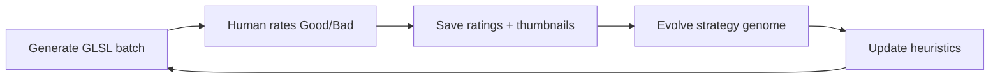

# ShaderMind

**An autonomous GLSL artist that learns taste in public.**

Most creative AI assumes one aesthetic fits everyone. ShaderMind doesn't. It generates WebGL fragment shaders, learns from your Good/Bad ratings, and rewrites an explicit **strategy genome** — a readable preference model inspired by [PLUS](https://arxiv.org/abs/2507.13579) (Preference Learning Using Summarization).

> *"Don't make something new — change one thing each day."* — Zach Lieberman, *10 Years of Daily Sketches* (metaphorical north star: **3,650 sketches**)

---

## Why it exists

| Problem | ShaderMind's answer |
|---|---|
| RLHF treats taste as one shared reward model | **Heuristic memory** + **strategy genome** — text you can read and audit |
| Prompt → image, then forget | **Continual learning loop** across generations |
| Black-box scores | Reflection notes, approval-rate heuristics, evolution timeline |
| Generic shader toys | Stateful agent: plans → codes → curates → evolves → repeats |

---

## See it in 30 seconds

1. Open the **Studio** — live WebGL shaders animate with `u_time`, `u_resolution`, `u_mouse`.
2. Rate each sketch **Good** or **Bad**, add an optional note, hit **Submit & next batch**.
3. Scroll **Mind** — heuristics like *"organic flow + slow motion → 75% approval"*.
4. Scroll **Evolution** — generation milestones with saved thumbnails of approved work.
5. Click **Explain artistic evolution** — the agent narrates its own arc.

The artifact isn't one pretty shader. It's the **preference model getting sharper**.

---

## Continual learning loop



**Human-in-the-loop by default** — the agent never auto-rates your batch unless you switch to autonomous/hybrid mode.

**Fast path** — one inference call writes a full batch of compile-ready shaders; strategy evolution runs in the background so the next batch starts immediately.

---

## Interface

| Region | What you get |
|---|---|
| **Studio** | Current batch in a full-width gallery; click any cell for detail view |
| **Latest reflection** | Agent self-criticism after your last curation |
| **Evolution** | Real milestones per generation — notes + thumbnails of Good shaders |
| **Mind** | Learned heuristics, reflection log, artistic monologue |

Batch composition (configurable, default **3**): evolutionary remixes from approved shaders, directive responses to your notes, and mutation sketches with an explicit hypothesis on the card.

---

## Tech stack

| Layer | Choice |
|---|---|
| Frontend | Vanilla HTML/CSS/JS, WebGL 1.0 renderer, editorial gallery UI |
| Backend | Node.js + Express |
| AI | **DigitalOcean Inference** (primary) — per-task model pools; optional Gemini fallback |
| Storage | **MongoDB Atlas** in production; `database.json` for local dev / failover |
| Deploy | DigitalOcean App Platform or Docker (`8080`) |

### Generation pipeline (fast mode)

1. **Single-shot batch** — metadata + inline GLSL in one JSON response (`qwen3-coder-flash` first for code)
2. **Validate & patch** — WebGL 1.0 sanitizer, Ashima noise helpers, low-effort output rejection
3. **Human curation** — ratings persisted; 64×64 JPEG thumbnails captured on Good
4. **Async evolution** — heuristics + strategy genome update without blocking the next batch

---

## Quick start

### Prerequisites

- Node.js 20+
- [DigitalOcean Model Access Key](https://docs.digitalocean.com/products/gradient-ai-platform/how-to/use-serverless-inference/)
- MongoDB Atlas URI (recommended for production)

### Run locally

```bash
git clone https://github.com/jin-dalrae/shadermind.git
cd shadermind
npm install
cp .env.example .env
# Edit .env — set DIGITAL_OCEAN_MODEL_ACCESS_KEY and MONGODB_URI
npm start
```

Open **http://localhost:8080**

### Migrate local JSON → MongoDB

```bash
npm run migrate:mongo
```

### Deploy (DigitalOcean App Platform)

1. Connect this repo; set `run_command` to `node server.js`
2. Add secrets: `DIGITAL_OCEAN_MODEL_ACCESS_KEY`, `MONGODB_URI`
3. Without `MONGODB_URI`, deploy falls back to bundled `database.json` — your Atlas history won't appear in production

See `.do/app.yaml` and `Dockerfile` for reference configs.

---

## Configuration highlights

| Variable | Default | Purpose |
|---|---|---|
| `LEARNING_MODE` | `human` | `human` · `autonomous` · `hybrid` |
| `GENERATION_MODE` | `fast` | `fast` (1 call) or `staged` (plan + N GLSL calls) |
| `BATCH_SIZE` | `3` | Shaders per generation |
| `AUTOPILOT_INTERVAL_MS` | `0` | Delay after submit before next batch |
| `EVOLUTION_ASYNC` | `true` | Strategy update in background |

Full list in [`.env.example`](.env.example).

---

## Hackathon alignment

**Theme: Continual Learning** — ShaderMind adapts *how* it generates from real curation feedback: memory rollups, heuristic extraction, strategy rewrites, and remix seeds from approved shaders.

**Research tie-in: PLUS** — Like PLUS's preference summaries, ShaderMind compresses curation history into interpretable text that conditions the next generation — not a frozen reward model.

**Prizes**

- **DigitalOcean** — Inference-native stack, App Platform deploy, lightweight Node server
- **Gemini** — Optional fallback path (`ALLOW_GEMINI_FALLBACK=true`)

---

## Project structure

```
shadermind/
├── server.js              # Express API, autopilot loop, generation
├── lib/                   # AI routing, GLSL validation, memory, math cookbook
├── public/                # Gallery UI, WebGL renderer, shader patcher
├── storage/               # MongoDB + JSON adapters
├── scripts/               # migrate:mongo, repair:glsl
└── project_blueprint/     # Pitch, PRD, hackathon notes
```

---

## References

- Nam, H., Wan, Y., Liu, M., Ahnn, P., Lian, J., & Jaques, N. (2025/2026). *Learning to summarize user information for personalized reinforcement learning from human feedback.* [arXiv:2507.13579](https://arxiv.org/abs/2507.13579)
- Lieberman, Z. — [*10 Years of Daily Sketches*](https://zach.li) (creative practice metaphor)

---

## License

Hackathon prototype — see repository for usage terms.